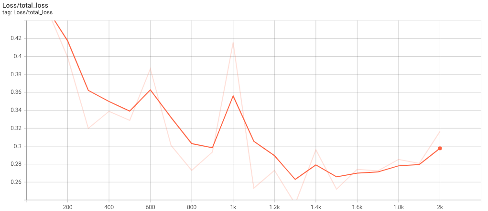

# Using Object Detection Algorithms to Identify and Translate American Sign Language

Training computer vision networks to detect simple hand signals and complex motions 

## **Introduction**

There are currently close to 1 million people across the United States and Canada that use sign language as their primary form of communication. However, less than 1% of the population in each country understands sign language, which can make interactions for the deaf or hard of hearing difficult. This project's focus will be to address this issue with computer vision and machine learning. My hypothetical stakeholder in this context will be the Google Translate team— they would like to expand their tool in order to incorporate the translation of live action sign language gestures. I’ll be photographing and recording myself performing various ASL actions, and training deep neural networks to detect, track, and translate my symbols and gestures.

## **Data Collection and Labeling**

For this project, I decided to create my own dataset of images and videos to train my models with. This dataset will be split into two sections— a set of still frame photos where to goal will be to identify and box the hand symbol that appears on screen, and a set of videos (30 frames each) with the goal of identifying the gesture being performed and writing the translated English equivalent to screen. 

### **Still Frames**

I used the OpenCV python library to collect 120 unique images of myself holding up the international signs for thumbs up, thumbs down, and peace— 40 instances of each. In order to annotate these images, I employed another python library called LabelImg to manually box the symbols and apply the correct training labels. One example of this process is shown in *Figure 1*:

> *Figure 1: Here, boxes have been drawn around the two instances of ‘Thumbs Down’ I’m holding up, and the label has been assigned to each.*

### **Action Gestures**

Next, I again used OpenCV to collect 240 unique 30-frame videos of myself performing ASL gestures. These videos are split into 4 categories: ‘Hello’, ‘Nice to meet you’, ‘Thank you’, and ‘Goodbye’. However, the classification task this time is different— instead of identifying and boxing an object in a single image, the gesture needs to be tracked through all 30 frames in order to make a detection. For this task, I used a python library called MediaPipe, which marks ‘keypoints’ in each image to track your face, arms, and hands. These same keypoints are given coordinates in each of the 30 frames in a sequence, and thus the positioning and movement of your body can be followed. An example of this process is shown in *Figure 2*:

> *Figure 2: One frame of a video in which MediaPipe has labeled the keypoints on my face, arms, and hands.* 

## **Model Training**

### **Single Frame Detections**

For this task, I used the SSD MobileNet V2 FPNLite 320x320 model architecture from the Tensorflow 2 Detection Model Zoo. The benefit of this model is its speed, averaging detections in 22 ms or less. This is important when you need to make many detections every second, as is the case in this project. The ultimate goal was to identify, box, and track symbols as you move them around in real time, and this architecture suits that need perfectly. *Figure 3* shows the training loss in intervals of 100 time steps, generated from TensorBoard logs:

> *Figure 3: TensorBoard plot of the total loss as the model is trained through iteration 2,000*

To evaluate the model’s performance on unseen data, it was fed images from the test set and its predictions were compared to the ground truth created from the labeling process. On a set of 24 images, the model was 100% accurate. One example of a correct prediction is shown in *Figure 4*:

> *Figure 4: The model correctly detects and boxes these two unseen instances of ‘Peace’ that I am holding up*

Finally, the model was put to the test on a live video feed of myself holding these symbols up, and moving them around the screen to demonstrate its ability to quickly track in real time. The results are shown in *Figure 5*:

> *Figure 5: Real time predictions of the model from my webcam. It is able to make detections and track my hands around the screen with great accuracy*

### **Action Gestures**

In order to detect more complex motions across the 30 frame videos, I used a sequential Keras model with LSTM layers. While it may seem like a task with more input parameters than a still image, MediaPipe only stores the locations of each keypoint in the images rather than every individual pixel. This vastly reduces the number of inputs when compared to the 320x320 resolution photos being fed to the MobileNet. Because of this, the Keras sequential model will suffice and training speed is much higher. *Figure 6* shows the loss and accuracy of the model on the training and validation data across 500 epochs:

> *Figure 6: Loss and accuracy of the model on the training and validations sets through 500 epochs*

This model also performed well on unseen data, with an accuracy of 100%. The confusion matrix for the test data is shown in *Figure 7*:

> *Figure 7: Confusion matrix for the 24 instances of test data split between 4 labels*

And finally, this model was also used to detect live action gestures from my webcam and translate them in real time by printing the English equivalent to the screen. *Figure 8* shows a recording of this process:

> *Figure 8: Real time predictions of the model from my webcam, and the printed sentence translated directly on the screen*

> *Figure 1*

## **Data Augmentation**

Because of the limited size of this dataset, and the fact that machine learning models thrive on more data, we decided to use augmentation to increase the number of training examples available to our model. Images we flipped horizontallly and rotated by a random angle of ± 20 degrees. These augmentations are shown in *Figure 2*:

> *Figure 2*

## **Performance Metrics**

In order to judge the performance of our model, we decided on two metrics:

### **Recall**

Our first performance metric is recall- a measure of our model's true positive rate. We would like our recall to be high, to maximize the probability that if someone truly has pneumonia, the model predicts this correctly and flags them for a medical follow-up.

### **Accuracy**

Our second performance metric is accuracy- a measure of how many of our model's predictions are correct in total. Simply predicting every child has pneumonia would result in a 100% recall score, which is obviously not helpful in this context. We want to maximize accuracy so that we avoid a large false positive rate that does not reduce the strain on medical staff who are already spread too thin. 

## **Model Selection**

We fit many different models to our data in order to find the most effective solution. *Figure 3* below shows a table of the performance metrics of various models. 

> *Figure 3*

All models performed exceedingly well in regards to recall, but where the convolutional neural network shines is in its overall accuracy. This is important in reducing those false positives, and thus it is the model we chose to pursue for this problem.

## **Final Model**

Our final model architecture consisted of an Xception model pretrained on the ImageNet dataset, with custom pooling and output layers specific to our binary classification problem. *Figure 4* shows our chosen metrics' evolution by training epoch and *Figure 5* shows the confusion matrix for this model's performance on our test data set:

> *Figure 4*

> *Figure 5*

### **Final Recall Score**

Out of 390 children in the test set with pneumonia, our model was able to recognize 389 of them, for a recall score of over 99%. This left only a single false negative, meaning our model is able to flag almost every child who truly has pneumonia for a follow up with a medical professional. 

### **Final Accuracy**

Out of 594 children in the test set total, our model correctly classified 545. This high accuracy is important for reducing our false positives and ensuring that valuable medical resources are budgeted correctly for those in need. 

## **Conclusions & Recommendations**

We find that our convolutional neural network provides the optimal predictive power for this business problem. We believbe this model will indeed help humanitarian aid workers use their valuable medical resources more efficiently. Doctors can be deployed where they are most needed, and the children in need of aid can be identified more quickly. We recommend this system not as a replacement for a medical professional's opinion, but as a supplement to these resources and a technique to help filter through what may currently be simply too much data. 

[Full Jupyter Notebook](https://github.com/hall-nicholas/flatiron-ds-project-4/blob/main/code/Draft_final.ipynb)  

[Non Technical Presentation](https://github.com/hall-nicholas/flatiron-ds-project-4/blob/main/Non%20Technical%20Presentation.pdf)  

[Original Dataset](https://data.mendeley.com/datasets/rscbjbr9sj/2)
